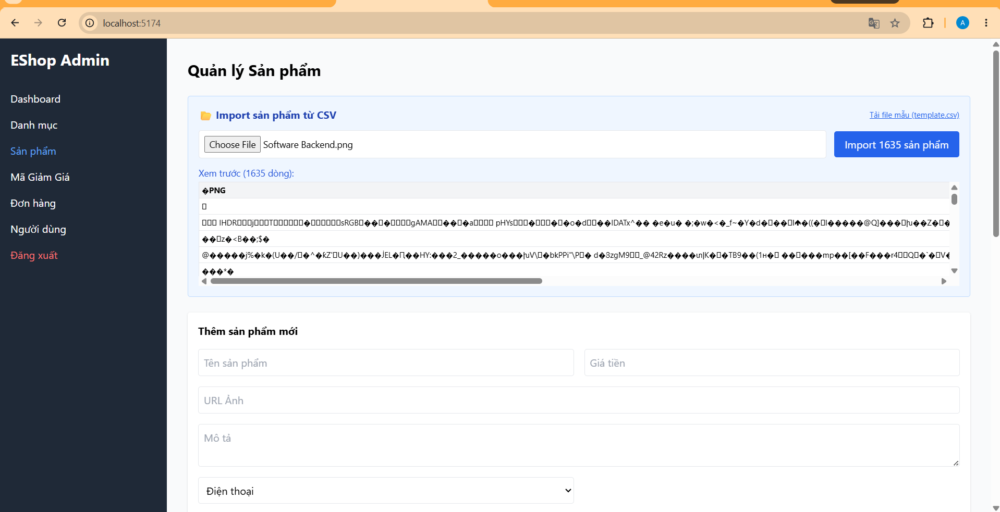
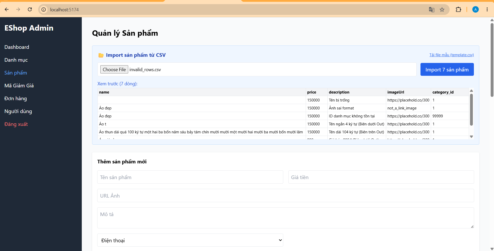
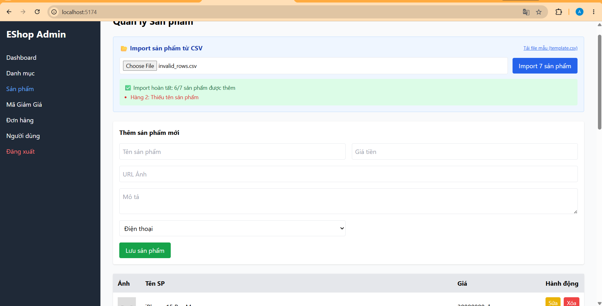
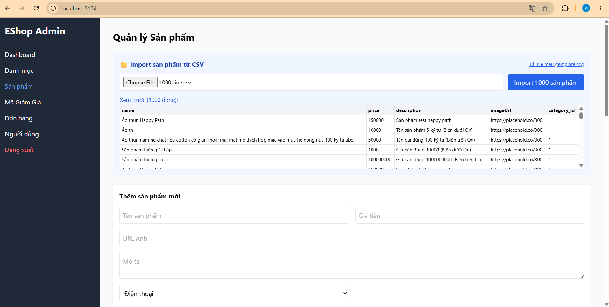
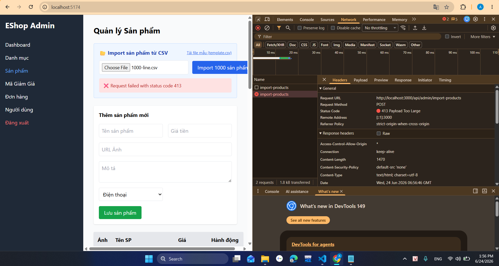
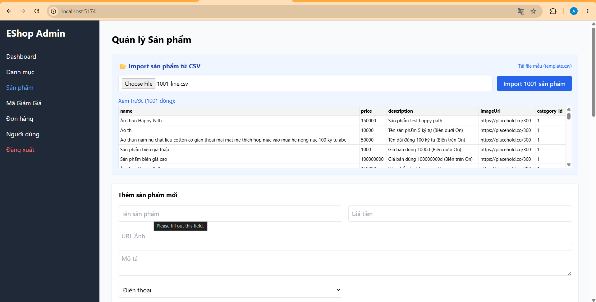
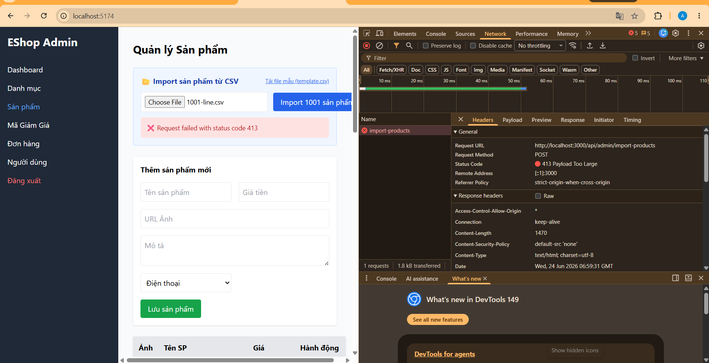
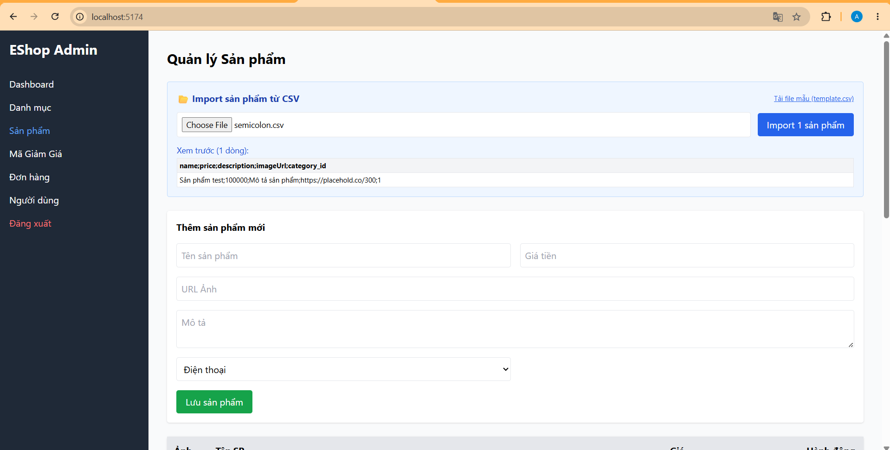
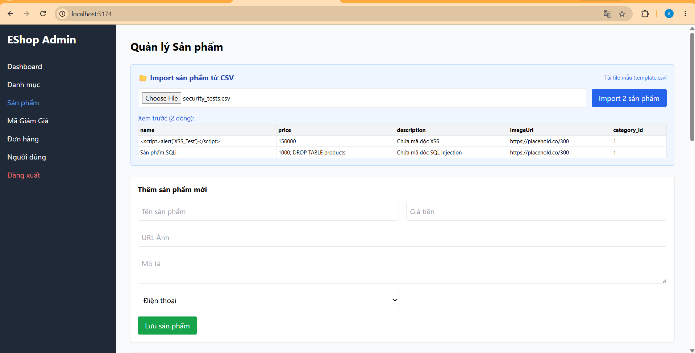
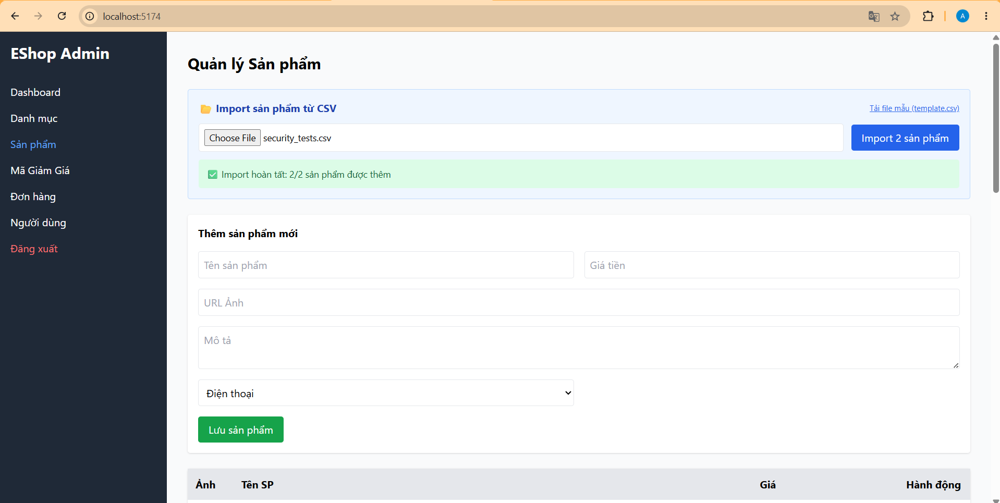

# BÁO CÁO KẾT QUẢ KIỂM THỰC THẾ - FR-16: PRODUCT IMPORT TỪ CSV

- **Mã sinh viên:** 23127001
- **Họ và tên:** Nguyễn Lê Quan Anh
- **Kỹ thuật áp dụng:** Domain Testing & Boundary Value Analysis (3-Value BVA)

---

## I. DANH SÁCH TEST CASES & KẾT QUẢ THỰC THI

**Pre-conditions chung:** 
- Người dùng đã đăng nhập vào hệ thống EShop với quyền Quản trị viên (Admin).
- Người dùng đang ở màn hình "Import Products".
- Có sẵn danh mục hợp lệ trong DB (`category_id = 1` đang Active).

| Test Case ID | Technique | Test Title | Input Data | Expected Result | Actual Result | Status | Screenshot Link |
| :--- | :--- | :--- | :--- | :--- | :--- | :--- | :--- |
| **FR16-DT-001** | Domain Testing | Import thành công file CSV tất cả dữ liệu hợp lệ | File `valid_products.csv`. | Hệ thống báo thành công, ghi vào CSDL. | Hệ thống import thành công các dòng dữ liệu chuẩn. | **Passed** | *(Dữ liệu hợp lệ)* |
| **FR16-DT-002** | Domain Testing | Báo lỗi khi upload sai định dạng file | File `products.pdf` hoặc `.xlsx` | Hệ thống chặn ngay khi chọn file hoặc báo lỗi. | Hệ thống không chặn, vẫn cho tải lên file không phải `.csv`. | **Failed** | [wrong-tail.png](./wrong-tail.png) |
| **FR16-DT-003** | Domain Testing | Báo lỗi khi cấu trúc header thiếu cột bắt buộc | File CSV thiếu cột `price`. | Hệ thống báo lỗi thiếu cột. | Hệ thống báo lỗi đúng kỳ vọng, không cho import. | **Passed** | *(Dữ liệu hợp lệ)* |
| **FR16-DT-004** | Domain Testing | Báo lỗi khi bỏ trống trường bắt buộc | File CSV có cột `name` bỏ trống | Hệ thống báo lỗi tên không được để trống. | Hệ thống phát hiện trường `name` trống và từ chối import. | **Passed** | [invalid_01.png](./invalid_01.png) <br> [invalid_02.png](./invalid_02.png) |
| **FR16-DT-005** | Domain Testing | Báo lỗi khi kiểu dữ liệu không hợp lệ | Cột `imageUrl` mang giá trị: `not_a_link_image` | Hệ thống báo lỗi định dạng URL ảnh không hợp lệ. | Hệ thống không validate URL, vẫn cho phép import. | **Failed** | [invalid_01.png](./invalid_01.png) <br> [invalid_02.png](./invalid_02.png) |
| **FR16-DT-006** | Domain Testing | Báo lỗi khi ID Danh mục không tồn tại | Cột `category_id` mang giá trị: `99999` | Hệ thống báo lỗi danh mục không tồn tại. | Hệ thống bỏ qua khóa ngoại, vẫn cho phép import category_id ảo. | **Failed** | [invalid_01.png](./invalid_01.png) <br> [invalid_02.png](./invalid_02.png) |
| **FR16-BVA-001** | BVA | Upload file thành công có dung lượng tối đa (On) | File CSV dung lượng đúng `~5.00 MB` | Import thành công nếu dữ liệu hợp lệ. | Chưa đạt đến dung lượng biên này hệ thống đã bị treo máy (mới 113KB). | **Failed** | [1000-line_01.png](./1000-line_01.png) <br> [1000-line_02.png](./1000-line_02.png) |
| **FR16-BVA-002** | BVA | Báo lỗi khi upload file vượt dung lượng ranh giới (Out) | File CSV dung lượng `>5.00 MB` | Hệ thống từ chối file và báo lỗi vượt giới hạn. | Hệ thống bị treo/đơ trước khi đạt đến biên này do xử lý file kém. | **Failed** | [1001-line_01.png](./1001-line_01.png) <br> [10001-line_02.png](./10001-line_02.png) |
| **FR16-BVA-003** | BVA | Import thành công khi số dòng đạt tối đa cho phép (On) | File CSV chứa đúng `1000` dòng dữ liệu | Import thành công toàn bộ 1000 sản phẩm mà không bị Timeout. | Hệ thống bị treo cứng khi tải file 1000 dòng mặc dù file rất nhẹ (113KB). | **Failed** | [1000-line_01.png](./1000-line_01.png) <br> [1000-line_02.png](./1000-line_02.png) |
| **FR16-BVA-004** | BVA | Báo lỗi khi số lượng dòng vượt giới hạn quy định (Out) | File CSV chứa `1001` dòng dữ liệu | Hệ thống báo lỗi vượt quá số lượng 1000 dòng. | Hệ thống bị treo/lỗi trước khi kịp hiển thị cảnh báo chặn quá dòng. | **Failed** | [1001-line_01.png](./1001-line_01.png) <br> [10001-line_02.png](./10001-line_02.png) |
| **FR16-BVA-005** | BVA | Báo lỗi khi tên sản phẩm ngắn hơn tối thiểu (Out) | Tên sản phẩm có 4 ký tự: `Áo t` | Hệ thống báo lỗi tên quá ngắn. | Hệ thống vẫn import thành công tên sản phẩm dài 4 ký tự. | **Failed** | [invalid_01.png](./invalid_01.png) <br> [invalid_02.png](./invalid_02.png) |
| **FR16-BVA-006** | BVA | Import thành công khi tên vừa đủ độ dài tối thiểu (On) | Tên sản phẩm dài đúng 5 ký tự: `Áo th` | Hệ thống xử lý và thêm sản phẩm thành công. | Hệ thống xử lý và lưu sản phẩm thành công. | **Passed** | *(Dữ liệu hợp lệ)* |
| **FR16-BVA-007** | BVA | Import thành công khi tên dài đến mức tối đa (On) | Tên sản phẩm dài đúng `100` ký tự. | Hệ thống xử lý và thêm sản phẩm thành công. | Hệ thống xử lý và lưu sản phẩm thành công. | **Passed** | *(Dữ liệu hợp lệ)* |
| **FR16-BVA-008** | BVA | Báo lỗi tên khi sản phẩm vượt quá quy định (Out) | Tên sản phẩm dài `101` ký tự. | Hệ thống báo lỗi tên vượt quá giới hạn. | Hệ thống vẫn cho phép import tên sản phẩm dài 101 ký tự. | **Failed** | [invalid_01.png](./invalid_01.png) <br> [invalid_02.png](./invalid_02.png) |
| **FR16-BVA-009** | BVA | Báo lỗi khi giá bán nhỏ hơn mức quy định (Out) | Cột `price` bằng `999` | Hệ thống báo lỗi giá thấp hơn mức tối thiểu. | Hệ thống không validate giá tối thiểu, vẫn cho phép import. | **Failed** | [invalid_01.png](./invalid_01.png) <br> [invalid_02.png](./invalid_02.png) |
| **FR16-BVA-010** | BVA | Import thành công khi giá bán nằm tại biên dưới (On) | Cột `price` bằng `1000` | Sản phẩm được import thành công với giá 1000đ. | Sản phẩm được import thành công với giá 1000đ. | **Passed** | *(Dữ liệu hợp lệ)* |
| **FR16-BVA-011** | BVA | Import thành công khi giá bán nằm tại biên trên (On) | Cột `price` bằng `100000000` | Sản phẩm được import thành công với giá 100 triệu. | Sản phẩm được import thành công với giá 100 triệu. | **Passed** | *(Dữ liệu hợp lệ)* |
| **FR16-BVA-012** | BVA | Báo lỗi khi giá bán cao hơn mức cho phép (Out) | Cột `price` bằng `100000001` | Hệ thống báo lỗi giá bán vượt mức tối đa. | Hệ thống không validate giá tối đa, vẫn cho phép import. | **Failed** | [invalid_01.png](./invalid_01.png) <br> [invalid_02.png](./invalid_02.png) |
| **FR16-EDGE-001** | Edge Case | Thông báo khi import file rỗng (Chỉ chứa Header) | File CSV chỉ có tiêu đề. | Hệ thống hiển thị cảnh báo không chứa dữ liệu. | Hệ thống báo lỗi chính xác, không thực thi import. | **Passed** | *(Dữ liệu hợp lệ)* |
| **FR16-EDGE-002** | Edge Case | Lỗi Parse file khi CSV sử dụng dấu phân cách chấm phẩy (;) | File CSV ngăn cách bởi dấu `;`. | Hệ thống báo lỗi cấu trúc cột không hợp lệ. | Hệ thống hiển thị cấu trúc sai lệch nhưng không báo lỗi cụ thể. | **Failed** | [semicolon.png](./semicolon.png) |
| **FR16-EDGE-003** | Edge Case | Hiển thị lỗi ngôn ngữ do mã hoá file (Encoding ANSI) | Cột `description` lưu dưới mã hoá ANSI. | Hệ thống từ chối hoặc báo lỗi font chữ. | Hệ thống vẫn import khiến font chữ hiển thị nát hoàn toàn trên UI. | **Failed** | [ansi.png](./ansi.png) |
| **FR16-SEC-001** | Security | Ngăn chặn mã độc XSS trong trường dữ liệu Text | Cột `name` chứa payload XSS. | Dữ liệu bị từ chối Import hoặc bị mã hoá chuỗi HTML. | Hệ thống không lọc đầu vào, cho phép tải lên và kích hoạt mã độc trên UI. | **Failed** | [secure_01.png](./secure_01.png) |
| **FR16-SEC-002** | Security | Chống tấn công SQL Injection thông qua file tải lên | Cột `price` chứa giá trị bẻ gãy SQL. | Hệ thống báo lỗi giá bán không hợp lệ và chặn lại. | Hệ thống hoàn toàn không lọc đầu vào, cho phép import chuỗi SQL độc hại. | **Failed** | [secure_02.png](./secure_02.png) |

---

## II. DANH SÁCH ẢNH CHỤP MINH CHỨNG CHI TIẾT (FULL-SIZE SCREENSHOTS)

Dưới đây là chi tiết các ảnh chụp màn hình kiểm thử thực tế được phóng to rõ nét phục vụ cho việc chấm điểm:

### 1. FR16-DT-002 (Lỗi không chặn file sai định dạng đuôi)


### 2. FR16-DT-004, DT-005, DT-006, BVA-005, BVA-008, BVA-009, BVA-012 (Lỗi không kiểm duyệt dữ liệu nhập)
*Hệ thống chỉ bắt được lỗi trống tên (invalid_01), các trường hợp sai độ dài và sai giá trị số học khác đều bị bỏ qua (invalid_02).*

**Minh chứng 01:**


**Minh chứng 02:**


### 3. FR16-BVA-001, BVA-003 (Lỗi sập hệ thống khi đạt biên 1000 dòng / file dung lượng nhẹ 113KB)
*Hệ thống quay vòng và bị treo máy hoàn toàn, không thể phản hồi.*

**Minh chứng 01:**


**Minh chứng 02:**


### 4. FR16-BVA-002, BVA-004 (Lỗi sập hệ thống khi vượt biên 1001 dòng)
*Hệ thống đứng im và không thể hiển thị trang web.*

**Minh chứng 01:**


**Minh chứng 02:**


### 5. FR16-EDGE-002 (Lỗi không phân tích được dấu phân cách chấm phẩy ;)


### 6. FR16-EDGE-003 (Lỗi hiển thị nát font do mã hóa ANSI)


### 7. FR16-SEC-001 (Lỗi dính mã độc XSS hiển thị trên giao diện)


### 8. FR16-SEC-002 (Lỗi lọt chuỗi tấn công SQL Injection)

```